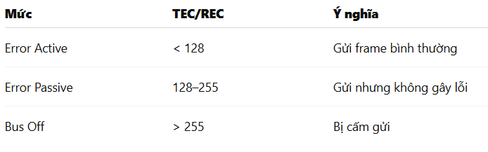

## Tổng Quan kiến thức về CAN

**1. CAN hoạt động thế nào?**
- **CAN KHÁC UART** — nó không gửi từng byte

**CAN gửi nguyên 1 FRAME gồm:**

- ID (11 hoặc 29 bit)
- DLC (độ dài 0–8 bytes)
- DATA (0–8 bytes)
- CRC + ACK + EOF (phần cứng tự lo)
- Ta chỉ set: **ID + DLC + Data**, rồi bật TXRQ → phần cứng lo hết

**ID**

- Trong STM32F103, mỗi mail-box truyền gồm 4 thanh ghi: 
- TIR : Chứa ID + các flag (IDE/RTR) + TX request
- TDTR : Chứa DLC (độ dài dữ liệu)
- TDLR : Chứa 4 byte dữ liệu đầu (byte 0–3)
- TDHR : Chứa 4 byte dữ liệu sau (byte 4–7)
-> Mỗi lần truyền 1 frame → Ta phải ghi 4 thanh ghi này.

- Standard ID phải shift lên 21 bits : TIR = ID << 21;  // ID = 0x321 → 0x321 << 21
- STID (Standard ID part) 11 bit → nằm ở bit 21..31 , IDE = 0

- Extended ID : TIR = ((uint32_t)id << 3) | CAN_TI0R_IDE; 
- EXID (extended part) 18 bit → nằm ở bit 3..20 , IDE = 1


**SET DLC (Data Length Code)**

- TDTR = len & 0xF; // len = {0,1,2,...,8} tương ứng 1 byte , 2 byte ,...
- Set len > 8 → frame không hợp lệ
- Quên xóa TDTR trước khi ghi → gửi lỗi

**SET DATA (0–8 BYTES)**

- Dữ liệu ghi vào 2 thanh ghi 32 bit
- DATA chia 4 byte / 4 byte
```c
TDLR = b0 | b1<<8 | b2<<16 | b3<<24
TDHR = b4 | b5<<8 | b6<<16 | b7<<24
```

**IDE**
- IDE cho CAN biết kiểu ID ta đang dùng:
- IDE = 0 : Standard frame (ID = 11-bit ) : Khung CAN cổ điển, phổ biến nhất
- IDE = 1 : Extended frame (ID = 29-bit ) : Khung mở rộng, dùng trong các hệ thống phức tạp


**Ví dụ đầy đủ gửi 0x321 với 8 bytes**

```c
CAN_TxMailBox_TypeDef *mb = &CAN1->sTxMailBox[0];

mb->TIR  = (0x321 << 21);   // Standard ID
mb->TDTR = 8;               // DLC = 8

mb->TDLR = (0x11) |
           (0x22 << 8) |
           (0x33 << 16) |
           (0x44 << 24);

mb->TDHR = (0xAA) |
           (0xBB << 8) |
           (0xCC << 16) |
           (0xDD << 24);

mb->TIR |= CAN_TI0R_TXRQ;   // Trigger send
```

**Các lỗi phổ biến**
- ID không shift lên 21 : Frame bị hỏng
- Len > 8 : Frame invalid, không gửi
- Quên set IDE cho extended ID : Bus nhận sai
- Ghi nhầm byte cao/thấp : Data đảo thứ tự
- Quên clear mailbox trước ghi mới : Gửi data cũ


**2. ID quyết định ưu tiên**
- ID càng nhỏ → ưu tiên càng cao : ID = 0x001 thắng ID = 0x7FF
→ Đây là “arbitration”: 2 node có thể cùng gửi, CAN sẽ tự chọn

**3. Frame type**
- Data Frame : Gửi dữ liệu
- Remote Frame : Yêu cầu node khác gửi Data Frame
- Error Frame : Tự sinh khi lỗi bus
- Overload Frame : Trì hoãn bus (hiếm dùng)

**5. Tốc độ CAN = (fPCLK) / (BRP × TQ)**
- **TQ = 1 + TS1 + TS2** // Tổng TQ trên 1 bit , số 1 đầu tiên là SYNC_SEG = 1 TQ (luôn luôn là 1) , để đồng bộ bit đầu mỗi bit
- UART: mỗi bit = 1 xung clock của baudrate.
- CAN: mỗi bit = gồm nhiều Time Quanta (TQ)
-> CAN lấy clock gốc rồi chia nhỏ thành các đơn vị siêu nhỏ gọi là Time Quanta , sau đó ghép lại thành 1 bit.
- Tốc độ CAN = PCLK / (BRP × TQ)  // BRP = độ chia clock
- TS1 tạo sample point , TS2 chỉnh pha

**Tại sao phải chia bit thành nhiều TQ?**

- Đồng bộ : CAN là multi-master, nhiều node → nhiều dao động clock khác nhau. Phải có vùng SYNC để sửa sai pha

- Lấy mẫu (Sampling Point) : Điểm lấy mẫu phải nằm gần 80% của bit → Vì vậy TS1 luôn dài
- Chỉnh pha : Phần cứng thay đổi TS2/TS1 nhỏ để xử lý jitter, nhiễu, lệch clock

- Thực tế: TS1 lớn gấp 3–4 lần TS2

**6. Một Frame = nhiều bit**
- Thường ở phần mềm không thấy
- Ta thường nghĩ CAN = “gửi 8 byte” -> Không đúng — thực tế frame có chuỗi bit phức tạp
- SOF → ID → RTR → IDE → DLC → DATA → CRC → ACK → EOF

**7. CAN có lỗi tự phục hồi (tính năng bá đạo nhất)**
- MCU duy trì 2 counter: TEC (Transmit Error Counter) , REC (Receive Error Counter)
- 

- Node gửi gây lỗi : TEC + 8
- Node nhận phát hiện lỗi : REX + 1
- Node nhận ACK OK : TEC-1
-> CAN đảm bảo rằng node lỗi không được phép làm loạn bus

**BA TRẠNG THÁI LỖI**

- A. ERROR ACTIVE (trạng thái bình thường) (TEC < 128 và REC < 128)
- Được gửi Error Frame mạnh (dominant bit) , Gửi và nhận bình thường
- B. ERROR PASSIVE (cảnh báo) (TEC >= 128 OR REC >= 128)
- Không được phép làm nhiễu bus → Chỉ được gửi Error Frame ở mức yếu hơn
- C. BUS OFF (node bị đuổi khỏi mạng) (TEC > 255)
- Node bị ngắt kết nối khỏi bus CAN , Không được gửi, không được nhận , Không được ACK ai

**CƠ CHẾ TỰ HỒI PHỤC**

- A. Tự giảm counter nếu bus ổn định : TEC -= 1 , REC -= 1 
- Nếu không thấy lỗi thêm → Node tự từ Error Passive → Active

- B. Tự thoát BUS-OFF
- Khi node vào Bus-Off, nó không tự động bật lại
- Node phải đếm được 128 lần bus idle và phần mềm phải cho phép : CAN1->MCR |= CAN_MCR_ABOM; // Auto Bus-Off Management


**8. CAN có Filter — không bật thì không nhận gì**
- Filter hoạt động như “bộ lọc ID”
- Không bật filter → không nhận gì.
- Không thoát INIT filter → filter không hoạt động.
- Mask = 0 → nhận tất cả.
- Mask = 0xFFFF → không nhận gì (unless ID = 0xFFFF)
- Gán filter vào FIFO0 hoặc FIFO1 phải đúng.
- Filter scale phải đúng 32-bit nếu dùng Standard ID 11 bit.

**9. FIFO0 + FIFO1 (đọc frame xong phải “release”)

- CAN1->RF0R |= CAN_RF0R_RFOM0;
- Nếu quên → FIFO full → mất dữ liệu , Không nhận được bất cứ frame nào sau 3 frame đầu tiên

- Trong CAN của STM32F103 , dữ liệu nhận không đi thẳng vào thanh ghi DR như UART
- Thay vào đó, nó đi vào 2 hàng đợi (queue) : FIFO0 – hàng đợi 1 , FIFO1 – hàng đợi 2
- Mỗi FIFO có thể chứa tối đa 3 frame 

**Khi một frame tới:**

- CAN hardware đẩy frame vào FIFO0 hoặc FIFO1 (tùy filter)
- ISR được gọi (nếu enable interrupt)
- Ta đọc dữ liệu : ID , DLC , byte 0–3 , byte 4–7
- Ta **BẮT BUỘC** phải thông báo phần cứng rằng “tao đọc xong rồi” : CAN1->RF0R |= CAN_RF0R_RFOM0; // Release FIFO 0

**Vậy release làm gì?**
- Xóa entry đầu FIFO (đẩy toàn bộ FIFO lên)
- Giảm FMP0 (FIFO Message Pending)

**Tóm lại**

- FIFO0/1 là queue phần cứng chứa tối đa 3 frame
- Đọc xong phải release
- Nếu quên release → FIFO đầy → mất dữ liệu 
- ISR phải: check FMP0 , đọc frame , release FIFO 
- Nếu release sai → mất frame


**10. Mailbox (3 ô để gửi)**
- Mỗi lần ta gửi 1 CAN frame, ta phải bỏ nó vào 1 "hộp thư" phần cứng.
- Khi gửi ta chọn mailbox trống (TME0/1/2) 
- Ghi ID, DLC, DATA 
- Set TXRQ 
- STM32 lo phần còn lại

**Vì sao cần tận 3 mailbox?**
- Ta gửi frame 1 → CAN đang arbitration và chưa phát
- Trong thời gian đó Ta muốn gửi frame 2 → KHÔNG CÓ CHỖ ĐỂ BỎ nếu chỉ có 1 mailbox
-> → Dữ liệu không thể xếp hàng như UART FIFO

**Lỗi dễ mắc phải**
- Không kiểm tra TME → ghi đè mailbox đang bận
- Không set TXRQ → mailbox không bao giờ gửi
- Ghi TIR rồi TXRQ ngay → ID chưa có giá trị chuẩn : TIR (ID, RTR, IDE) , TDTR , TDLR/TDHR , **TXRQ cuối cùng**
- Nếu ta không set IDE=0 cho Standard → phần cứng hiểu Extended ID -> Ghi TIR = 0 trước → rồi mới set ID
- Không xử lý lỗi TXOK/ALST/ TERR 
- Không clear mailbox sau khi gửi : TXRQ tự clear khi frame bắt đầu gửi → nhưng TXOK phải đọc TSR để clear cờ lỗi


**11. Loopback mode = “test offline không cần transceiver” 
- Phát → tự nhận
- Rất tiện để test code CAN

**12. CAN không có "buồng chờ" dài**
- Bus luôn busy → Ta không thể gửi liên tục 1ms như UART
- Nếu gửi quá nhanh → arbitration thua → mailbox luôn bận

**13. Bit-stuffing — nguyên nhân khiến oscilloscope nhiễu**
- Nếu 5 bit cùng mức liên tiếp → nhét thêm 1 bit nghịch
- Rất quan trọng khi debug bằng oscilloscope

**14. CAN không cần master**
- Node nào cũng có quyền gửi
- Không có clock chung
- Không có master/slave
- Tất cả xử lý bằng arbitration

**15. CAN hỗ trợ multi-cast tự nhiên**
- Gửi 1 ID → tất cả node match ID đều nhận
- Không cần address như UART/I2C.

**16. VÌ SAO CAN CHẠY TỐT 1 Mbps, CÒN UART 1 Mbps THƯỜNG RẤT DỄ LỖI?**
- Vì CAN được thiết kế chuyên để truyền tốc độ cao và chống lỗi, còn UART thì “trần trụi”, không có cơ chế bảo vệ.
- UART truyền dạng không đồng bộ (asynchronous) → không có clock chung
→ Hai bên phải tự đo bit bằng cách dự đoán thời gian.
- UART chỉ chịu được ~2% sai lệch clock.
=> Ở 1 Mbps, MCU + USB-UART + PC clock rất dễ lệch quá mức này
- Mỗi bit CAN đều có vùng để chỉnh lại timing
- Clock lệch → CAN tự kéo lại → vẫn đọc đúng
-> CAN liên tục hiệu chỉnh → chạy được tốc độ cao

- CAN có Bit Stuffing : không cho phép quá 5 bit giống nhau liên tiếp ,Sau 5 bit, nó tự chèn 1 bit nghịch
->  Giúp giữ biên độ chuyển cạnh → receiver luôn đồng bộ
- CAN có cơ chế bắt lỗi mạnh , Nếu nhiễu → CAN tự nhận biết và gửi lại
- UART : Sai dữ liệu → không hề phát hiện được


## Giải thích các hàm 

### UART1_TxHex8()
```c
static void UART1_TxHex8(uint8_t v)
{
    const char *h = "0123456789ABCDEF";
    UART1_TxChar(h[v >> 4]);
    UART1_TxChar(h[v & 0xF]);
}
```
- Hàm này in 1 byte dưới dạng HEX (2 ký tự) , ví dụ v = 0xAB -> → sẽ in "A" rồi "B"
- v >> 4 : dịch phải 4 bit → lấy 4 bit cao , 0xAB >> 4 = 0x0A → index 10 → ký tự 'A'
- v & 0xF : giữ 4 bit thấp , 0xAB & 0x0F = 0x0B → index 11 → ký tự 'B'
- const char *h = "0123456789ABCDEF" -> Mảng tra cứu 16 ký tự -> index nào là ra ký tự HEX tương ứng
- Ta dùng chuỗi mà không dùng số là do 'A' != 10 , 'B' != 11  , 'A' = 0x41 (65 decimal) -> ký tự ASCII không liền với số 10–15
- Không phải mỗi lần gọi hàm là nó tạo mới chuỗi h , nó nằm trong Flash , không bị tạo lại , không tốn ram
 

### CAN_GPIO_Init()
```c
    /* Remap PB8/PB9 */
    AFIO->MAPR &= ~(3 << 13);
    AFIO->MAPR |=  (2 << 13); 
```
- Bit 13–14 trong AFIO->MAPR là nhóm CAN_REMAP (2 bit)
- 3 << 13 = b11 ở vị trí 13–14
- 00 : CAN_RX PA11 — CAN_TX PA12
- 01 : not used
- 10 : CAN_RX PB8 — CAN_TX PB9 
- 11 : CAN_RX PD0 — CAN_TX PD1


## CAN_Setup() 
**1. Bật Clock cho CAN1**
```c
RCC->APB1ENR |= RCC_APB1ENR_CAN1EN;
__DSB();
```
- __DSB() = chặn CPU lại, chờ tất cả lệnh ghi vào thanh ghi / bộ nhớ thực sự hoàn tất
- Lỗi phổ biến : vừa bật clock xong mà ghi ngay **CAN1->MCR** có thể FAIL (do clock chưa ổn định) -> mất INAK hoặc treo.
- __DSB() cần thiết đặc biệt khi code chạy trong tốc độ cao

**2. Reset toàn bộ khối CAN**
```c
RCC->APB1RSTR |=  RCC_APB1RSTR_CAN1RST;
RCC->APB1RSTR &= ~RCC_APB1RSTR_CAN1RST;
```
- Reset trước khi bắt đầu là bất buộc khi làm việc mức thanh ghi
- 1 → kích reset (pulse tác động vào mạch reset) -> tín hiệu điều khiển phần cứng
- Set = kích reset , lear = nhả reset, cho module hoạt động trở lại ,Nếu không clear → peripheral chết luôn


**3. Vào Init Mode**
```c
CAN1->MCR |= CAN_MCR_INRQ;
while (!(CAN1->MSR & CAN_MSR_INAK));
```
- Đăng ký request vào chế độ Init , Chờ đến khi hardware trả lời INAK = 1 → đã vào Init Mode
- Đây là điều kiện bắt buộc khi muốn cấu hình BTR, filter, mode CAN,...

**4.Config tốc độ baud**
```c
CAN1->BTR = 
    (3 << 0) |       // thực chất chia 4
    (11 << 16) |     // TS1 = 12 tq 
    (4 << 20) |      // TS2 = 5 tq 
    (0  << 24);      // SJW = 1 tq
```
- tq = (1 + TS1 + TS2) = 1 + 12 + 5 = 18 tq
- Baud = PCLK1 / ((BRP+1)* tq )= 36MHz ( 4 * 18 ) = 500 kbps
- Sampling point = (1 + TS1) / tq = 13 / 18 = 72.2% 
- Việc chọn Sampling Point rất quan trọng khi chạy CAN với dây dài, nhiễu
- Sampling Point = thời điểm mà bộ thu chốt giá trị logic của bit.
- 80% bit time = cho tín hiệu đủ thời gian “ổn định”, Nếu lấy ở cuối quá → không đủ thời gian điều chỉnh
- CAN bus dài : 80–87.5%
- Nhiễu cao : 85–87.5% 

**SJW**
→ cho phép CAN điều chỉnh tốc độ bit lệch tối đa 1 tq để giữ đồng bộ 
- CAN bus không có clock, các node tự do chạy bằng clock riêng → rất dễ lệch pha theo thời gian.
- SJW cho phép CAN kéo hoặc giảm bit một chút để đồng bộ lại
- 00 (1tq) , 01 (2tq), 02 (3tq),...
- SJW = 1 tq : cáp CAN ngắn , tốc độ ≤ 500 kbps
- SJW = 2–3 tq : tốc độ cao (1 Mbps) , dây dài (ví dụ 40–80m)
- SJW = 4 tq : có nhiều node , nhiễu mạnh

**5. Loopback mode**
- CAN1->BTR |= CAN_BTR_LBKM;
- CAN tự gửi – tự nhận lại , Không cần transceiver (MCP2551)
- Dùng để test logic
- Loopback bypass luôn chân TX/RX → không cần kết nối chân PB8 PB9 thực tế

**6. Auto retransmit + Bus-off recovery**
```c
CAN1->MCR &= ~CAN_MCR_NART; // Enable retransmission
CAN1->MCR |= CAN_MCR_ABOM;  // Auto bus-off recovery
```
- CAN tự thử gửi lại khi lỗi
- Khi vào bus-off → tự phục hồi sau 128 × 11-bit

- Nếu tắt Retransmit → frame lỗi biến mất, rất khó debug
- Nếu tắt Bus-Off Recovery → chỉ bật nguồn lại mới phục hồi

**7. Cấu hình Filter – nhận tất cả**
```c
 CAN1->FMR |= CAN_FMR_FINIT;  // vào filter init mode
 CAN1->FA1R = 0;              // disable filter 0
 CAN1->FM1R &= ~(1 << 0);     /* dua ve mask mode */
 CAN1->FS1R |=  (1 << 0);     /* 32-bit */
 AN1->FFA1R &= ~(1 << 0);    // FIFO 0
 CAN1->sFilterRegister[0].FR1 = 0; // ID    ((0x100 << 21);)
 CAN1->sFilterRegister[0].FR2 = 0; // mask = 0  (FR2 = (0x7FF << 21); )
 CAN1->FA1R |= (1 << 0);           // enable filter 0
 CAN1->FMR &= ~CAN_FMR_FINIT;      // exit filter init mode
```
- Filter phải config trong FINIT
- Đưa frame vào FIFO0
- F0 cho nhận tất cả ID (mask = 0)
```c
CAN1->sFilterRegister[0].FR2 = 0; // MASK = 0
```
- Mask mode + mask = 0 = nhận tất cả

**Khi frame đến, hardware so sánh :**
- (ID_frame & MASK) == (FILTER_ID & MASK)
- MASK bit = 1 → so sánh bit đó với **Filter ID**
- MASK bit = 0 → bỏ qua (không quan tâm)
- Ví dụ : Mask = 0x7FF (bật toàn bộ 11 bit: 111 1111 1111) -> 11 bit đều bị so sánh với Filter ID
- Filter ID = 0x100 -> Chỉ ID = 0x100 mới trùng -> nhận duy nhất ID 0x100
- Ví dụ 2 : Mask = 0x700 , Filter ID = 0x100 -> chỉ so sánh 3 bit cao nhất của ID: [10:8] với FilterID
-> nhận toàn bộ ID từ 0x100 đến 0x1FF (chỉ 3 bit đầu bị so sánh giống hết , các bit khác tùy ý)
- Muốn nhận tất cả ID chẵn → mask 0x001 , filterID = 0
- Muốn nhận tất cả ID lẻ → mask 0x001 và filterID = 1
```c
CAN1->FS1R |= (1 << 0);  
```
- Bit = 0 ứng với filter số 0 
- Khi set bit → filter 0 dùng chế độ 32-bit
- 32-bit mode: nhận cả Standard và Extended

**8. Thoát Sleep + Thoát Init Mode**
```c
CAN1->MCR &= ~CAN_MCR_SLEEP;
while (CAN1->MSR & CAN_MSR_SLAK);

CAN1->MCR &= ~CAN_MCR_INRQ;
```
- CAN wake-up khỏi sleep 
- Clear INRQ → bắt đầu chạy
- Nếu chưa thoát SLAVE mode (SLAK) → CAN không chạy
- Nếu không clear INAK → CAN vẫn ở Init mode → không gửi, không nhận.

**9. Chờ INAK clear**
```c
while (CAN1->MSR & CAN_MSR_INAK)
```
- Chờ đến khi CAN thoát hẳn Init Mode
- Nếu stuck → nghĩa là **cấu hình Clock sai** hoặc CAN vào bus-off ngay lập tức

**10. Enable Interrupt cho FIFO0**
```c
CAN1->IER |= CAN_IER_FMPIE0;
NVIC_EnableIRQ(USB_LP_CAN1_RX0_IRQn);
```
- Bật ngắt khi có số lượng frame mới (FMP0)
- Chạy vào handler: USB_LP_CAN1_RX0_IRQHandler

**11. Tóm tắt quy trình**
1. Bật clock
2. Reset CAN
3. Vào Init Mode (INAK = 1)
4. Cấu hình BTR (baud)
5. Cấu hình Mode (loopback/silent)
6. Config Filter
7. Thoát sleep
8. Thoát Init Mode (INAK = 0)
9. Bật interrupt


### USB_LP_CAN1_RX0_IRQHandler()
**1. while (CAN1->RF0R & CAN_RF0R_FMP0)**
- FMP0 = FIFO Message Pending 0
- Nếu FMP0 > 0 nghĩa là trong FIFO0 còn ít nhất 1 frame chưa đọc -> ISR xử lý tất cả

**2. Đọc toàn bộ 4 thanh ghi mailbox**
```c
uint32_t RIR  = CAN1->sFIFOMailBox[0].RIR; // ID, IDE (standard/extended), RTR
uint32_t RDTR = CAN1->sFIFOMailBox[0].RDTR; // DLC (data length)
uint32_t RDLR = CAN1->sFIFOMailBox[0].RDLR; // 4 bytes data (byte 0–3)
uint32_t RDHR = CAN1->sFIFOMailBox[0].RDHR; // 4 bytes data (byte 4–7)
```
**3. Lấy ID và loại frame**
```c
frame->ide = (RIR & CAN_RI0R_IDE) ? 1 : 0;
if (frame->ide)
    frame->id = (RIR >> 3) & 0x1FFFFFFF;
else
    frame->id = (RIR >> 21) & 0x7FF;
```
- IDE = 0 → Standard ID (11-bit) , (RIR >> 21) & 0x7FF
- IDE = 1 → Extended ID (29-bit) , (RIR >> 3) & 0x1FFFFFFF

**4. Lấy độ dài fame**
```c
frame->len = RDTR & 0xF; // DLC 4-bit → tối đa 8 byte
```

**5. Copy 8 byte data**
```c
for (i=0; i<4; i++) frame->data[i] = (RDLR >> (8*i)) & 0xFF;
for (i=4; i<8; i++) frame->data[i] = (RDHR >> (8*(i-4))) & 0xFF;
```

**6. Cập nhật ring buffer**
```c
can_rx_head = (can_rx_head + 1) % CAN_RX_RING_SIZE;
```
- Ví dụ buffer 16 phần tử: khi  can_rx_head = 15 -> về 0 -> Vòng tròn, không bị tràn

**7. Giải phóng FIFO0**
```c
CAN1->RF0R |= CAN_RF0R_RFOM0;
```
- RFOM0 = Release FIFO Output Mailbox
- Cho phép phần cứng pop frame tiếp theo
- Nếu không release → FIFO sẽ bị full → không nhận thêm được frame

### Vòng lặp chính while(1)

**1. Kiểm tra xem ring buffer có frame nào chưa xử lý**
```c
while (can_rx_tail != can_rx_head)
{
```
- can_rx_head: ISR cập nhật — nơi ghi frame mới nhận
- can_rx_tail: vòng while chính — nơi đọc frame đã nhận
- Nếu hai giá trị khác nhau → buffer có dữ liệu , Nếu bằng nhau → buffer rỗng

**2. Lấy frame từ ring buffer**
```c
volatile CAN_Frame_t *frame = &can_rx_ring[can_rx_tail];
```
- Dùng volatile → frame có thể bị ISR thay đổi bất kỳ lúc nào.
- Trỏ tới phần tử cần đọc

**3. In ID**
```c
if (frame->ide)
{
    UART1_TxStr("0x");
    UART1_TxHex16((frame->id >> 16) & 0x1FFF); // 13 bits cao
    UART1_TxHex16(frame->id & 0xFFFF);         // 16 bits thấp
}
```
- ID 29-bit được tách thành: 13 bit cao → (id >> 16) & 0x1FFF và 16 bit thấp → id & 0xFFFF
- UART chỉ có hàm in Hex16 nên ta dùng các này

**4. Standard ID (11-bit)**
```c
else
{
    UART1_TxStr("0x");
    UART1_TxHex16(frame->id & 0x7FF);
}
```
- ID 11-bit nằm tại bit 31 → 21 của RIR

**5. In dữ liệu**
```c
UART1_TxStr(" DATA=");
for (uint8_t i = 0; i < frame->len; i++)
{
    UART1_TxHex8(frame->data[i]);
    UART1_TxChar(' ');
}
UART1_TxStr("\r\n");
```
- In từng byte dữ liệu dạng hex 
- [CAN] RX ID=0x123 DATA=11 22 33 44 55 66 77 88

**6. Cập nhật tail (vòng tròn)** 
```c
can_rx_tail = (can_rx_tail + 1) % CAN_RX_RING_SIZE;
```


## Vấn đề gặp phải khi chạy code
- Hàm đứng ngay tại **while (CAN1->MSR & CAN_MSR_INAK)** trong **CAN_Setup** , do remap nhầm 
chân tại câu lệnh AFIO->MAPR |=  (2 << 13);  (viết nhầm thành (1<<13))


## Ảnh chụp 

